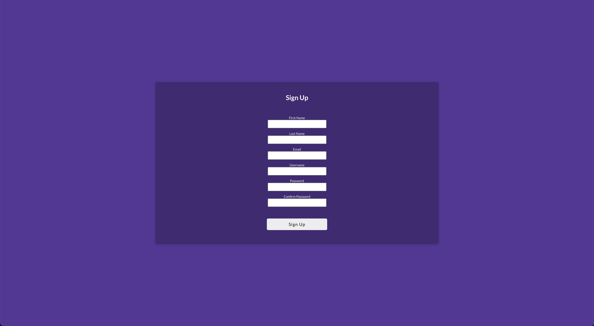

<h1>Habit Labs</h1>

Put your money where your mouth is! Build or break habits, and get your todos done by betting on youself. Each habit and todo is tied to a dollar amount. If you don't complete the task by its due date you lose the money! BEWARE of Sicko Mode If you toggle that on, you won't be able to delete or edit the task until you do what you set out to do! And remember, when you lie about completing a task, you're only cheating yourself..So get off your butt and do it! The clock is ticking.. 

<h1>Screenshots</h1>

Please see the screenshots folder for examples of the project in action.

<h1>CRUD Features</h1>
Habit Labs includes full CRUD (Create, Read, Update, Delete) features for new habits, todos, journals, and user accounts. There are also two partial CRUDs for creating, reading, and deleting completed habits (called check_ins) and for marking a task incomplete (called incomplete_logs)

<h2 align=center>Technologies</h2>

  
  
   
  
  
  
  
  
   
  

 

<h1>How to get started </h1>

Clone the repository and navigate to the project directory
Run npm install to install all necessary dependencies within the react-app folder.
Create a .env file and add the following variables:
SECRET_KEY=lkasjdf09ajsdkfljalsiorj12n3490re9485309irefvn,u90818734902139489230
DATABASE_URL=sqlite:///dev.db
SCHEMA=flask_schema

To build or reset the database and run seeders, run the following comands in the root folder.  1. pipenv shell 2. flask db upgrade 3. flask seed all. once you've run those three commands, start up the back end server in ther root directory by running flask run (make sure you're in your pipenv shell) head to the react-app folder and run npm start. (USE PORT 8000!!! flask run --port=8000)
The application should now be running on the port specified in your .env file.
Please note that the above instructions assume that you have the necessary dependencies installed on your machine. If you are missing any dependencies, please refer to their respective documentation to learn how to install them. 

<h3>Road Map</h3>

 Stripe integration for billing users - Hosted on AWS - Scripts to automatically bill failed tasks

